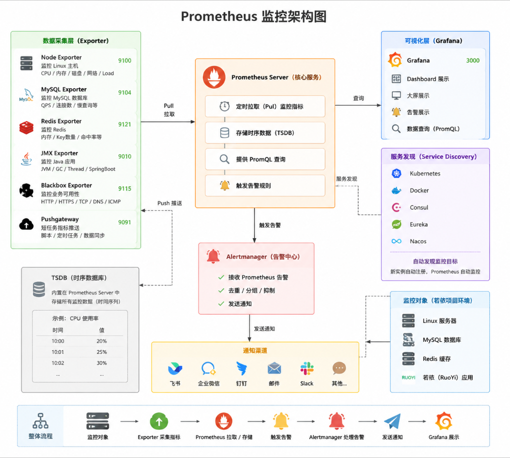

声明：这个笔记中，操作是在若依服务正常运行，没有问题的情况下执行
# 一、环境准备

## 1、克隆仓库：

```
#进入目录
cd /srv/app/tools

#将需要用的文件克隆到本地
git clone http://git.baway.work:10080/pt/pt1/monitor.git
```

## 2、相关服务

MySQL、docker、docker-compose都已安装部署完成

# 二、部署Prometheus等相关服务

## 1、修改配置文件

**注意：修改所有配置文件前，记得备份**

1）alertmanager

```
#进入目录
cd /monitor/config/alertmanager/

#编辑配置文件
vim alertmanager.yml
```


2）Prometheus

```
#进入目录
cd /monitor/config/prometheus

#编写配置文件
vim prometheus.yml
```

```

global:
  scrape_interval: 15s
  evaluation_interval: 15s

# 告警配置（关联 alertmanager）
alerting:
  alertmanagers:
    - static_configs:
        - targets: ['alertmanager:9093']   # docker compose 中服务名

# 规则文件（从 rules/ 目录加载所有 *.yml）
rule_files:
  - "rules/node/*.yml"
  - "rules/middleware/*.yml"
  - "rules/ruoyi/*.yml"

# 抓取配置
scrape_configs:
  - job_name: 'prometheus'
    static_configs:
      - targets: ['localhost:9090']

  - job_name: 'node-exporter'
    static_configs:
      - targets: ['node-exporter:9100']

  # 若依网关
  - job_name: 'ruoyi-gateway'
    metrics_path: '/actuator/prometheus'
    static_configs:
      - targets: ['192.168.23.232:8080']   # 替换为真实地址

  # Blackbox HTTP 探测（网关健康、Nacos）
  - job_name: 'blackbox-http'
    metrics_path: /probe
    params:
      module: [http_2xx]
    static_configs:
      - targets:
          - http://192.168.23.232:8080/actuator/health   # gateway health
          - http://192.168.23.232:8848/nacos              # nacos
    relabel_configs:
      - source_labels: [__address__]
        target_label: __param_target
      - source_labels: [__param_target]
        target_label: instance
      - target_label: __address__
        replacement: blackbox_exporter:9115

  # Blackbox TCP 探测（MySQL、Redis、Nacos 端口）
  - job_name: 'blackbox-tcp'
    metrics_path: /probe
    params:
      module: [tcp_connect]
    static_configs:
      - targets:
          - '192.168.23.232:3306'   # MySQL
          - '192.168.23.232:6379'   # Redis
          - '192.168.23.232:8848'   # Nacos
    relabel_configs:
      - source_labels: [__address__]
        target_label: __param_target
      - source_labels: [__param_target]
        target_label: instance
      - target_label: __address__
        replacement: blackbox_exporter:9115

  # prometheus.yml 中使用 /probe 端点
  - job_name: 'mysql-exporter'
    metrics_path: /probe
    params:
      auth_module: [client]  # 或 client.mysql2
    static_configs:
      - targets: ['192.168.23.232:3306']
    relabel_configs:
      - source_labels: [__address__]
        target_label: __param_target
      - source_labels: [__param_target]
        target_label: instance
      - target_label: __address__
        replacement: mysql-exporter:9104

  - job_name: 'redis-exporter'
    metrics_path: /scrape
    static_configs:
      - targets:
        - redis://192.168.23.232:6379
    relabel_configs:
      - source_labels: [__address__]
        target_label: __param_target
      - source_labels: [__param_target]
        target_label: instance
      - target_label: __address__
        replacement: redis-exporter:9121
```

3）mysql-exporter

```
CREATE USER 'exporter'@'%' IDENTIFIED BY 'exporter_pass';
GRANT PROCESS, REPLICATION CLIENT, SELECT ON *.* TO 'exporter'@'%';
FLUSH PRIVILEGES;
```

这三句命令，是创建数据库的用户、密码和授权，以及刷新
①可以进入容器内部，登录数据库执行

```
cd /srv/app/tools/RuoYi-Cloud-v3.6.6/docker

docker-compose exec -it ruoyi-mysql /bin/bash

mysql -u root -ppassword
```

②也可以打开navicat，点击目标数据库，点击查询，再点击新增查询，复制命令，点击运行

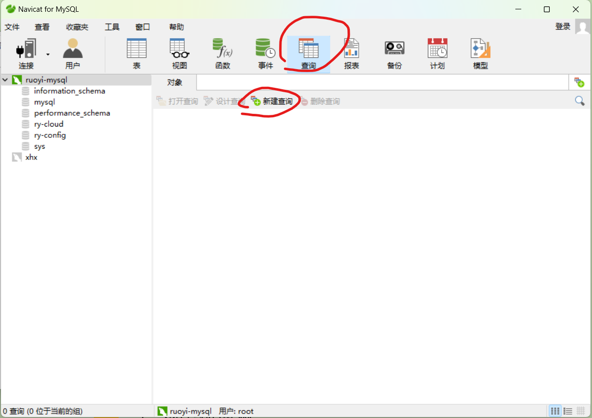

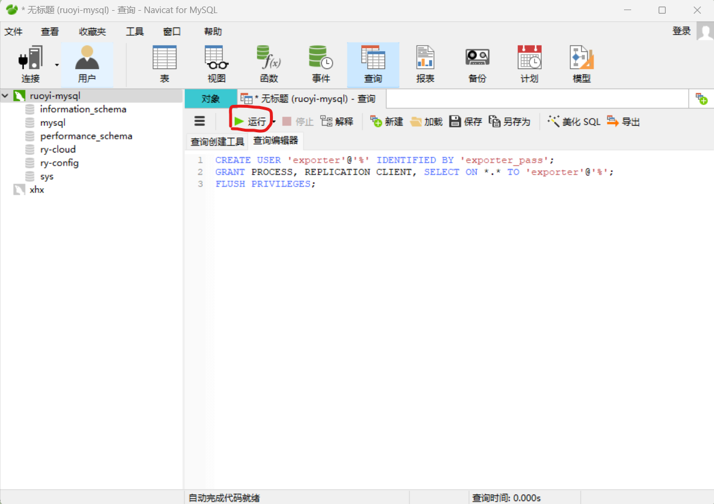

```
#进入目录
cd /monitor/config/

#创建目录
mkdir mysql-exporter

#编写文件
vim mysql-exporter/.my.cnf

# config/mysql-exporter/.my.cnf
[client]
user=exporter
password=exporter_pass
host=192.168.23.232
port=3306

```

4）docker-compose

```
#进入目录
cd /monitor/

#编辑配置文件
vim docker-compose.yml
```

```
version: '3.3'

networks:
  monitor:
    driver: bridge

services:
  prometheus:
    image: 10.203.41.20:8088/pt1/bitnami/prometheus:2.37.0
    container_name: prometheus
    hostname: prometheus
    restart: always
    volumes:
      - ./config/prometheus/:/etc/prometheus/
      - ./data/prometheus/:/var/lib/prometheus/
    ports:
      - "9090:9090"
    command:
      - '--config.file=/etc/prometheus/prometheus.yml'
      - '--storage.tsdb.path=/var/lib/prometheus/'
      - '--web.enable-lifecycle'
    environment:
      - TZ=Asia/Shanghai
    ulimits:
      nofile:
        soft: 65535
        hard: 65535
    networks:
      - monitor

  alertmanager:
    image: 10.203.41.20:8088/pt1/bitnami/alertmanager:0.25.0
    container_name: alertmanager
    hostname: alertmanager
    restart: always
    volumes:
      - ./config/alertmanager/:/opt/bitnami/alertmanager/conf/
    ports:
      - "9093:9093"
    command:
      - '--config.file=/opt/bitnami/alertmanager/conf/alertmanager.yml'
    environment:
      - TZ=Asia/Shanghai
    networks:
      - monitor

  node-exporter:
    image: 10.203.41.20:8088/pt1/bitnami/node-exporter:1.5.0
    container_name: node-exporter
    hostname: node-exporter
    restart: always
    ports:
      - "19100:9100"
    environment:
      - TZ=Asia/Shanghai
    volumes:
      - /:/rootfs:ro
      - /proc:/host/proc:ro
      - /sys:/host/sys:ro
      - /etc:/host/etc:ro
    command:
      - '--path.rootfs=/rootfs'
      - '--path.procfs=/host/proc'
      - '--path.sysfs=/host/sys'
      - '--collector.filesystem.ignored-mount-points=^/(etc/hostname|etc/hosts|etc/resolv.conf)$'
    networks:
      - monitor


  redis-exporter:
    image: 10.203.41.20:8088/pt1/redis_exporter:latest
    container_name: redis-exporter
    restart: always
    ports:
      - "9121:9121"
    command:
      - '--redis.addr=redis://10.203.41.68:6379'
        #- '--redis.password=your_redis_password'
    environment:
      - TZ=Asia/Shanghai
    networks:
      - monitor


  grafana:
    image: 10.203.41.20:8088/pt1/monitor/grafana:8.4.4
    container_name: grafana
    restart: always
    ports:
      - "3000:3000"
    environment:
      - TZ=Asia/Shanghai
      - GF_SECURITY_ADMIN_PASSWORD=admin
    volumes:
      - ./config/grafana/grafana.ini:/etc/grafana/grafana.ini
      - ./config/grafana/provisioning/:/etc/grafana/provisioning/
      - ./data/grafana/:/var/lib/grafana/
    networks:
      - monitor

  blackbox_exporter:
    image: 10.203.41.20:8088/pt1/bitnami/blackbox-exporter:latest
    container_name: blackbox_exporter
    restart: always
    ports:
      - "9115:9115"
    volumes:
      - ./config/blackbox/:/config/
    command:
      - '--config.file=/config/blackbox.yml'
    networks:
      - monitor


  mysql-exporter:
    image: 10.203.41.20:8088/pt1/prom/mysqld-exporter:latest
    container_name: mysql-exporter
    restart: always
    ports:
      - "9104:9104"
    volumes:
      - ./config/mysql-exporter/.my.cnf:/.my.cnf:ro
    command:
      - '--config.my-cnf=/.my.cnf'
      - '--collect.global_status'
      - '--collect.global_variables'
      - '--collect.info_schema.innodb_metrics'
      - '--collect.info_schema.processlist'
      - '--collect.info_schema.tables'
      - '--collect.perf_schema.eventsstatements'
      - '--collect.slave_status'
    environment:
      - TZ=Asia/Shanghai
    networks:
      - monitor


```

## 2、启动服务

这些服务都是基于docker容器创建的
```
#进入目录
cd /srv/app/tools/monitor/

#创建Prometheus等相关服务
docker-compose up -d 

#查看状态
docker-compose ps

#查看Prometheus的健康状态
curl -s http://localhost:9090/api/v1/targets | jp '.data.activeTargets[] | {job, health}'
```

**常见问题：**

在执行完docker-compose up -d，查看容器状态时，发现有两个容器的状态一直是重启状态
解决方法：
在执行完docker-compose up -d后，当前目录下会生成一个data的目录，目录下有两个文件夹

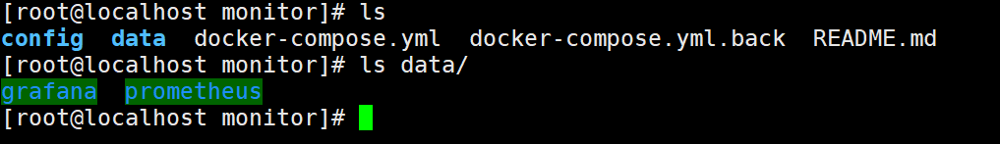

出现问题的原因是应为这个两个文件夹权限不够，加权限（在monitor目录下执行）

```
chmod 777 data/grafana
chmod 777 data/prometheus
```
加完权限后，重启容器即可

## 3、访问服务

打开浏览器，访问Prometheus和grafana

1）Prometheus     192.168.23.232:9090

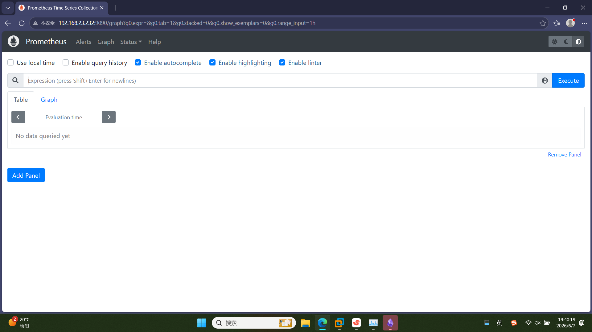

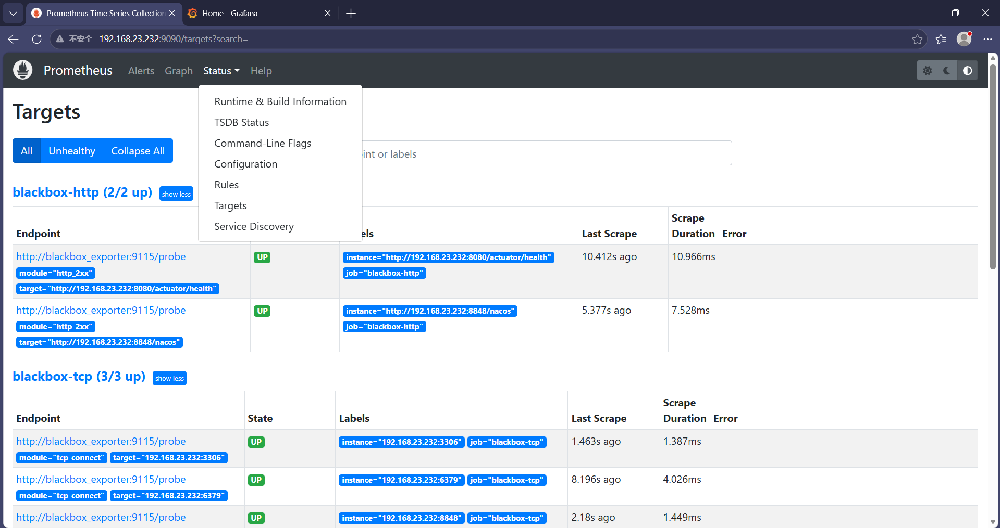

2）grafana     192.168.23.232:3000


查看监控面板

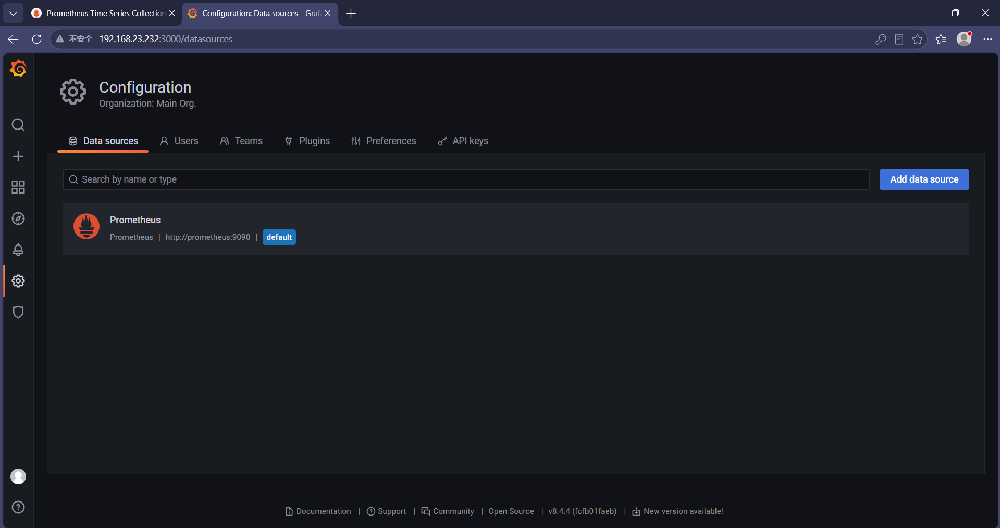

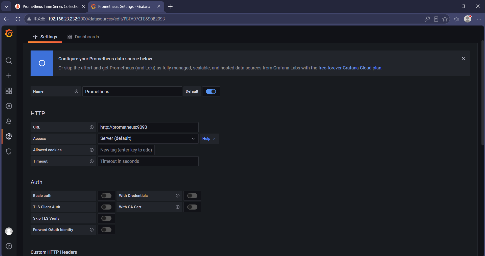

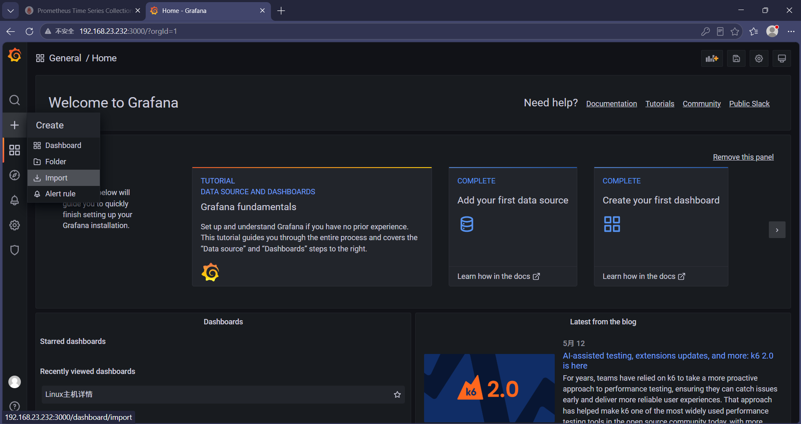

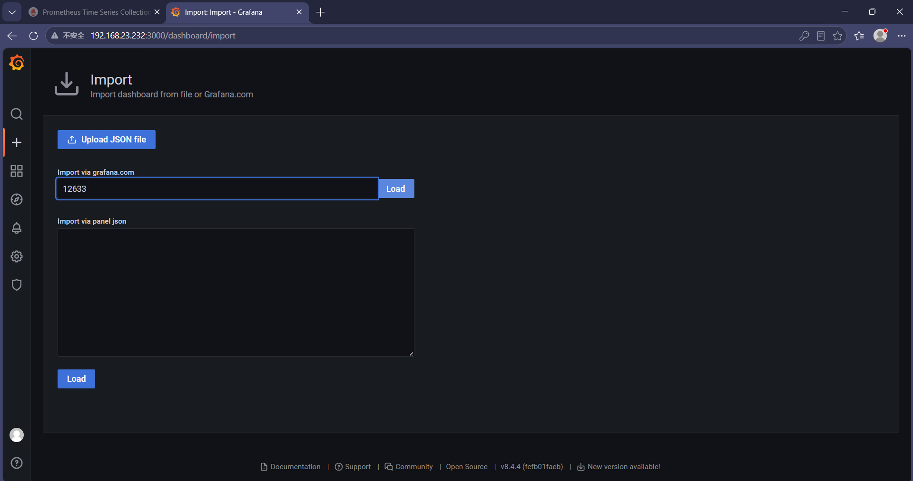

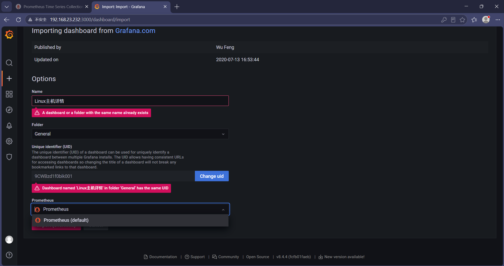

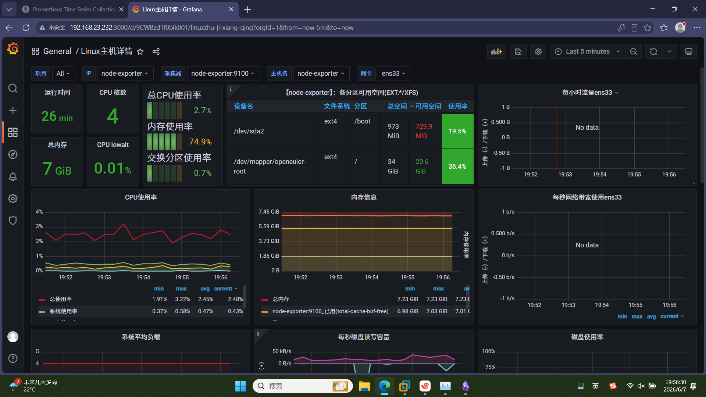

# 三、部署告警平台

1、克隆仓库

```
git clone http://git.baway.work:10080/ai/duty-alert.git
```

2、进入目录：
```
cd duty-alert
```
3、设置环境变量（文件名为：.env）：

```
# ============================================
# 值班告警平台配置
# ============================================

# --- 基础配置 ---
APP_NAME=DutyAlert
APP_ENV=production
LOG_LEVEL=info

# --- 飞书机器人 ---
FEISHU_WEBHOOK=https://open.feishu.cn/open-apis/bot/v2/hook/bda69fcf-840d-4e36-bde4-bb20b77538c1  #地址改为自己的
FEISHU_SECRET=

# --- 企业微信机器人 ---
WECOM_WEBHOOK=https://qyapi.weixin.qq.com/cgi-bin/webhook/send?key=xxxxxxxx

# --- 阿里云语音 ---
ALICLOUD_ACCESS_KEY_ID=LTAIxxxxxxxxxxxx
ALICLOUD_ACCESS_KEY_SECRET=xxxxxxxxxxxxxxxxxxxxxxxxxxxxxxxx
ALICLOUD_VOICE_NUMBER=0571xxxxxxxx
ALICLOUD_VOICE_TEMPLATE=TTS_12345678

# --- 告警升级策略 ---
P1_UPGRADE_MINUTES=5
P0_REPEAT_MINUTES=5
WORK_HOURS_START=9
WORK_HOURS_END=18

# --- 数据库 ---
DATABASE_URL=sqlite:///app/duty_alert.db

# --- 安全 ---
API_KEY=
ALLOWED_HOSTS=*
```

1）飞书机器人地址获取：
在飞书里面创建或找一个群

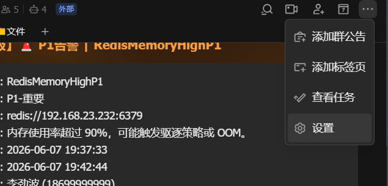

点击群机器人


点击添加，自定义机器人
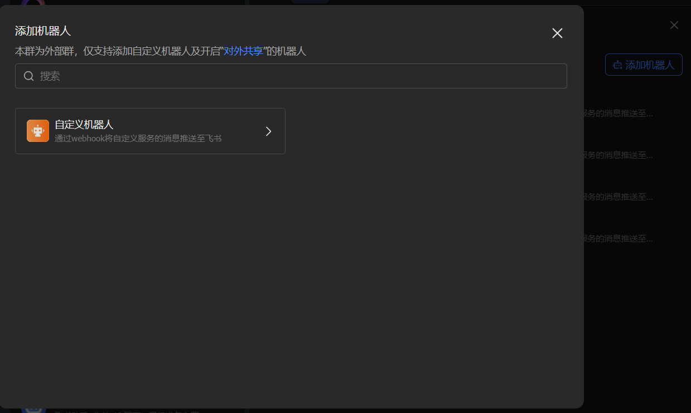

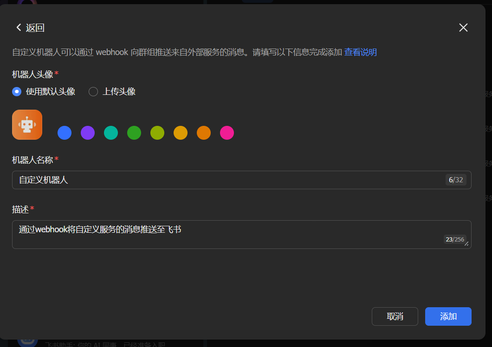

复制地址即可
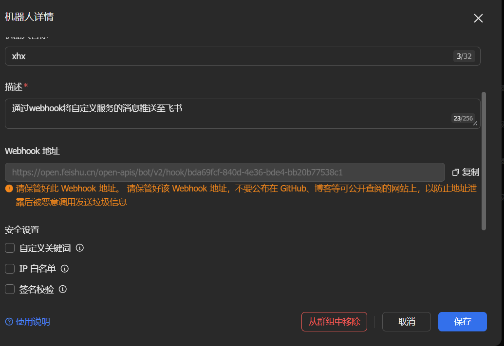

4、启动服务

执行启动命令：

```
sh start.sh  #执行脚本启动
```

5、访问服务

192.168.23.232:8000


6、测试告警

点击左侧的通知测试，点击发送测试

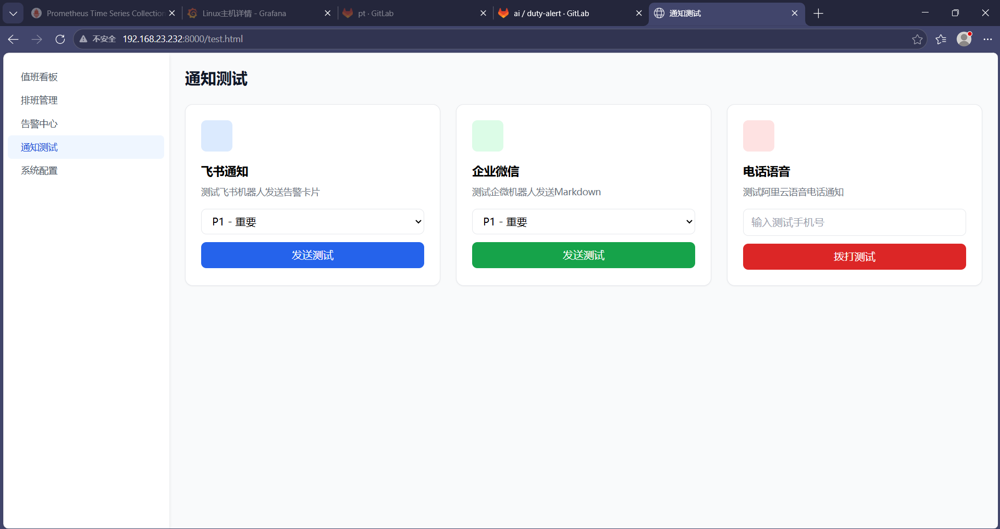

打开飞书，查看报警

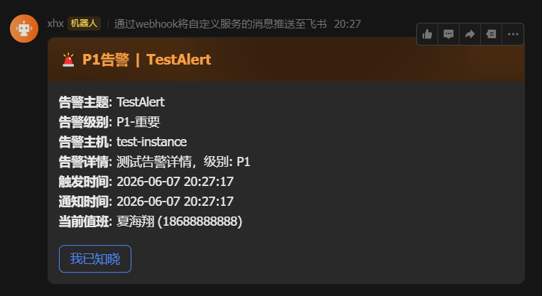