⼀ . 进⼊⽬录执⾏以下命令确保服务先可以使⽤

cd /srv/app/tools/
cd RuoYi-Cloud-v3.6.6
source /etc/profile
java --version
node -v
mvn -v

⼆ . 启动关于ruoyi的4个中间组件

docker-compose up -d ruoyi-mysql
docker-compose up -d ruoyi-redis
docker-compose up -d ruoyi-nacos
docker-compose up -d ruoyi-nginx

三 .启动7个核⼼组件

sh run.sh

四 .查看进程

ps -ef|grep ruoyi- |grep -v grep
cd ../

五 . 部署前先准备备份

1 .创建备份⽬录

mkdir -p /srv/backup/20260602
mkdir -p /srv/backup/20260602/ruoyi-ui
mkdir -p /srv/backup/20260602/ruoyi-system

2 .备份ruoyi-system后端代码

cp -r * /srv/backup/20260602/ruoyi-system//srv/backup/20260602/ruoyi-system/
备份ruoyi-ui的前端代码
cp -r src/ /srv/backup/20260602/ruoyi-ui/

3 .验证备份

ll /srv/backup/20260602/ruoyi-ui/
ll /srv/backup/20260602/ruoyi-system/

CREATE TABLE student_base_info (
id BIGINT PRIMARY KEY AUTO_INCREMENT COMMENT '主键ID',

student_no VARCHAR(32) COMMENT '学生编号',
class_name VARCHAR(50) COMMENT '班级',
graduate_date DATE COMMENT '毕业日期',
student_name VARCHAR(50) NOT NULL COMMENT '学生姓名',
id_card VARCHAR(18) NOT NULL COMMENT '身份证号（真实）',project_manager VARCHAR(50) COMMENT '项目经理',
career_advisor VARCHAR(50) COMMENT '就业指导',
home_address VARCHAR(255) COMMENT '家庭住址（按身份证）',
student_phone VARCHAR(20) COMMENT '学生电话',
father_phone VARCHAR(20) COMMENT '父亲电话',
mother_phone VARCHAR(20) COMMENT '母亲电话',
market_dept VARCHAR(50) COMMENT '所属市场部',
current_edu_level VARCHAR(20) COMMENT '当前学历',
current_graduate_time DATE COMMENT '当前学历毕业时间',
current_school VARCHAR(100) COMMENT '当前毕业院校',
current_major VARCHAR(100) COMMENT '当前专业',
studying_edu_level VARCHAR(20) COMMENT '在读学历',
studying_graduate_time DATE COMMENT '在读毕业时间',
studying_school VARCHAR(100) COMMENT '在读院校',
certificates VARCHAR(255) COMMENT '所持证书',
create_by VARCHAR(64) COMMENT '创建人',
create_time DATETIME COMMENT '创建时间',
update_by VARCHAR(64) COMMENT '更新人',
update_time DATETIME COMMENT '更新时间',
remark VARCHAR(500) COMMENT '备注'

) COMMENT='学⽣基础信息表';

六 . 进⼊navicat 将以上创建SQL语句

1 . 打开ry-cloud

2 . 点击查询
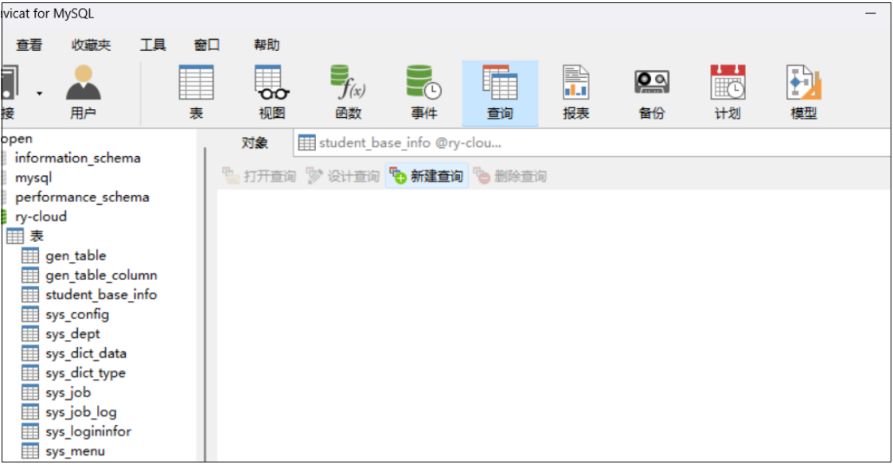
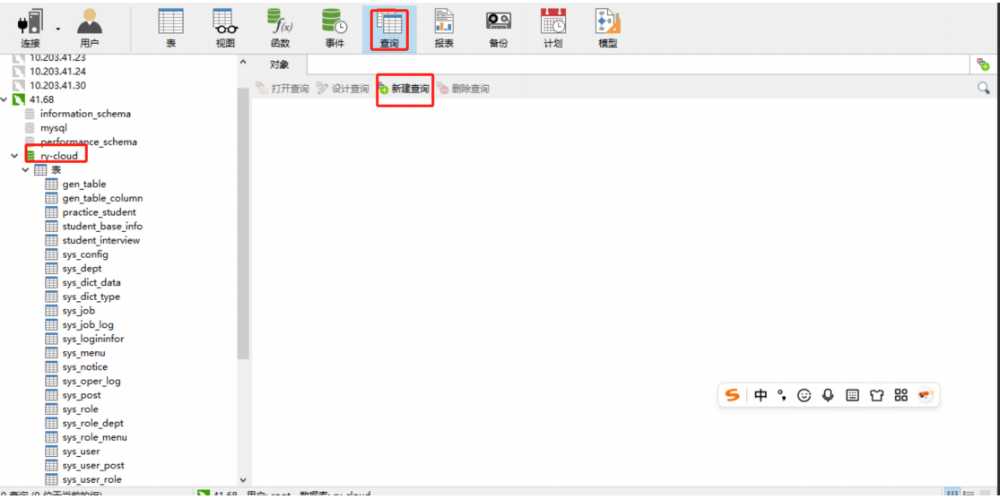
3 . 将上⾯的sql语句复制并点击运⾏
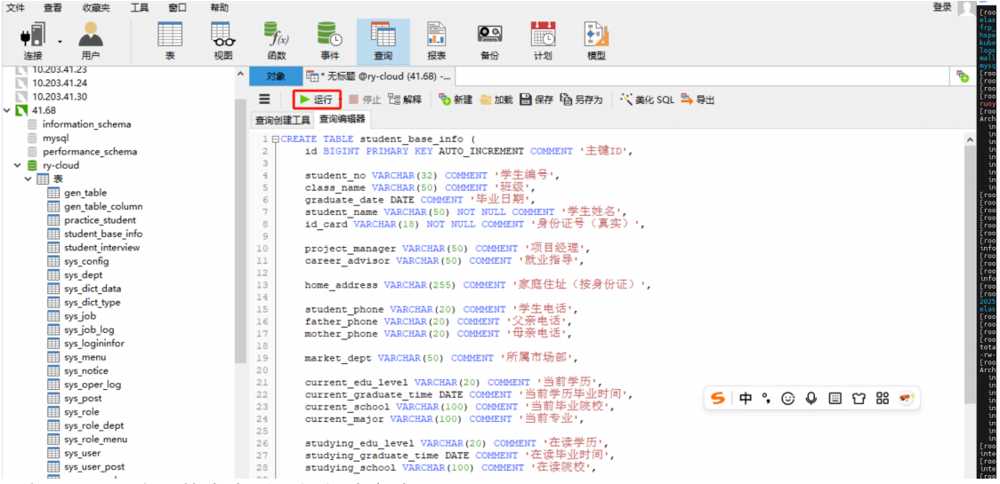
刷新ry-cloud库下的表查看已经创建完成
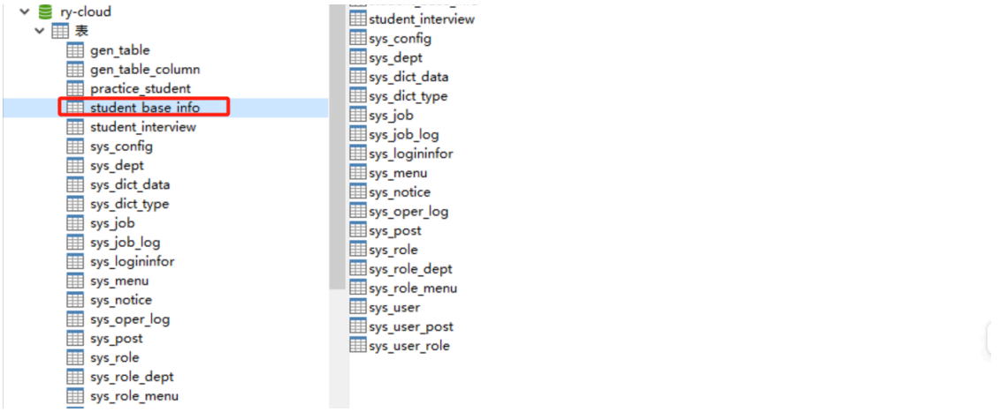
选中该表点右键设计表

可以查看该表的所有字段
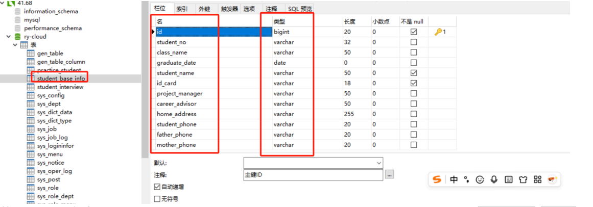
使⽤ruoyi平台⾃动升代码
访问若有平台，点击⾃动⽣成 导⼊ 选中刚刚创建的表
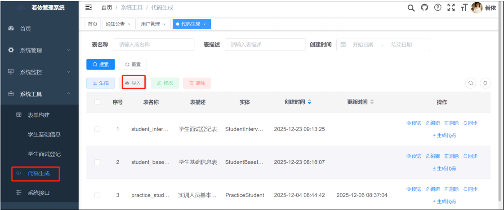
选择右侧⾃动⽣成代码
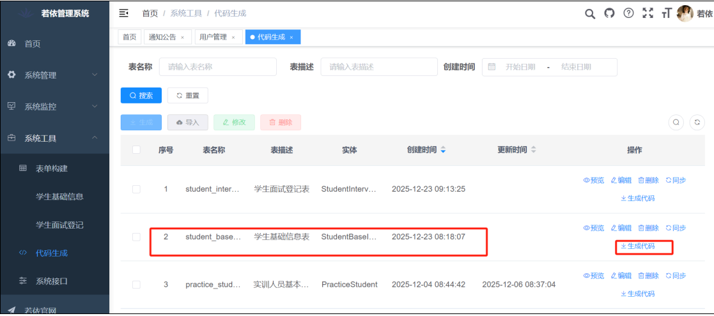
七 . 把ruoyi.zip的压缩包拖进来 rz -E

再次进⼊cd /srv/data/ 看看是否有⼀个ruoyi.zip的压缩包，有的解压缩
unzip ruoyi.zip ./

⼋ .下载并解压缩之后
分为以下三部分的代码
*.sql
vue⽬录 （前端源码⽬录，需要替换ruoyi-ui/src下）
main⽬录 （后端system源码⽬录，需要替换ruoyi-modules/ruoyi-system/src）
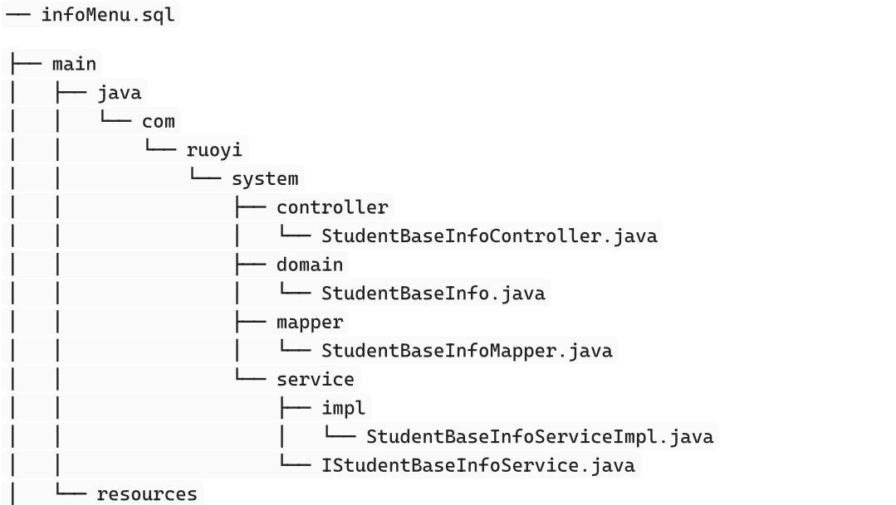
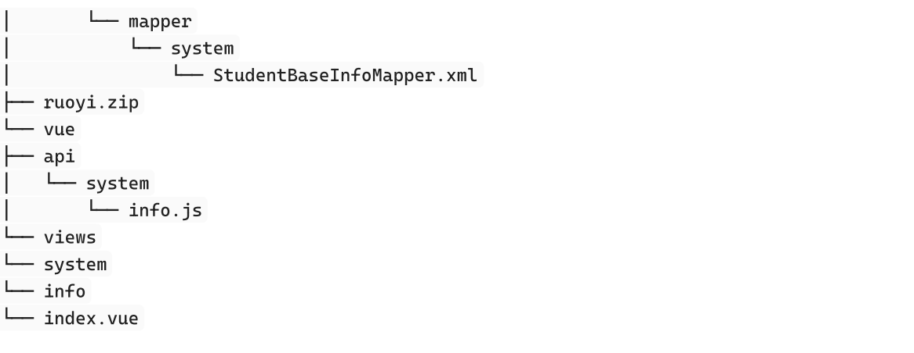
1 .cd /srv/app/tools/RuoYi-Cloud-v3.6.6 （开始替换）
cd ruoyi-ui/
ls
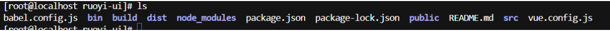
cd src/
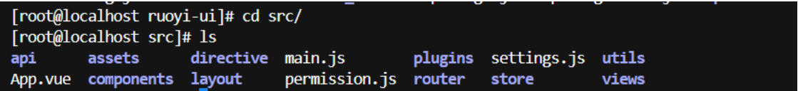
ll /srv/backup/20260602/ruoyi-ui/ 查看备份
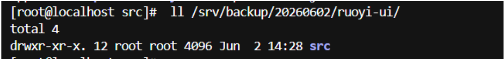
2 .复制前端代码到ruoyi-ui (cd ../../../../../ cd data/ 先退出⽬录，在进⼊到data⽬录中)
cp -r /srv/data/vue/api ./
ll vue/api/
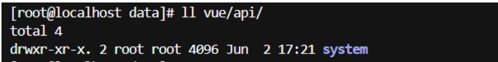
vue/api/system/info.js

cp -r /srv/data/vue/views ./
cd ../

九 .替换后需要重新把前端打包

1.1进⼊前端⽬录重新打包
cd ruoyi-ui && rm -rf dist && npm run build:prod
注意先删除保证没有了dist这个之后在执⾏之后的命令
1.2 验证是否重新⽣成dist
cd ruoyi-ui/
ls 或者 ll
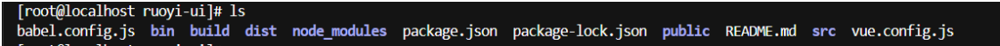
2 . 复制后端代码到ruoyi-system
2.1 cd ../ 返回上⼀级⽬录
cd ruoyi-modules/
ls
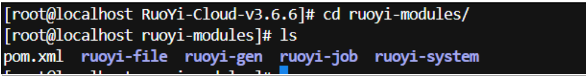
cd ruoyi-system/
ls
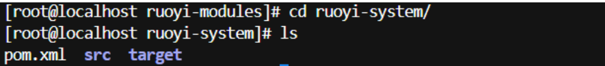
rm -rf target
cd /src
ls
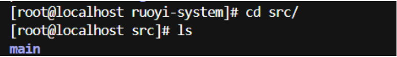
cd /main
ls
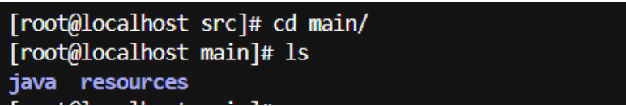
cd java/
ls

cd com/
ls

cd ruoyi/
ls
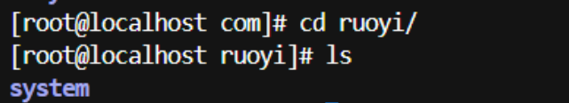
cd system/
ls
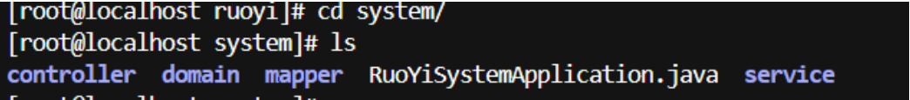
cp -r /srv/data/main/java/com/ruoyi/system/controller ./
ls controller/
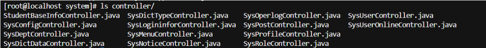
cp -r /srv/data/main/java/com/ruoyi/system/mapper ./
ls mapper/
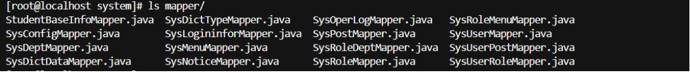
cp -r /srv/data/main/java/com/ruoyi/system/domain ./
ls domain/
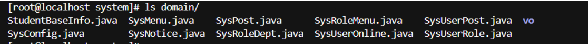
cp -r /srv/data/main/java/com/ruoyi/system/service ./
ls service/
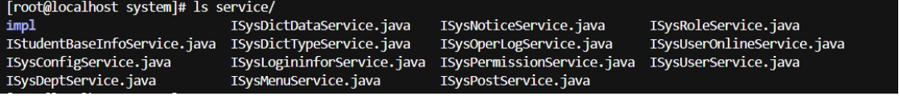
ls service/impl/
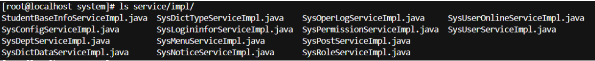
2.2 
cd ../../../../
ls
cd resources/
ls

cd mapper/system/
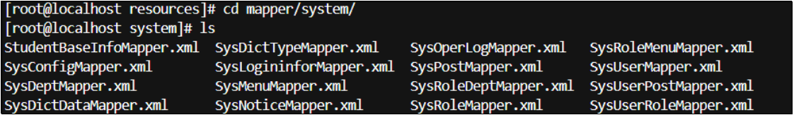
cd ../
cp -r /srv/data/main/resources/mapper ./
rm -rf mapper/
cp -r /srv/data/main/resources/mapper/system ./
ls system/
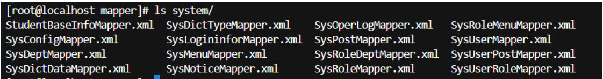
2.3 cd ../../../../
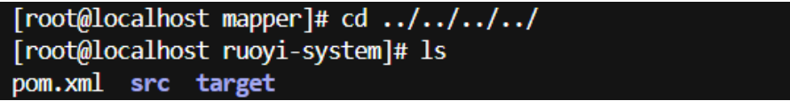
2.4 重新打包（因为此次只是打system模块，所以不需要全部打包）
mvn clean install
2.5 验证
ll target/ruoyi-modules-system.jar
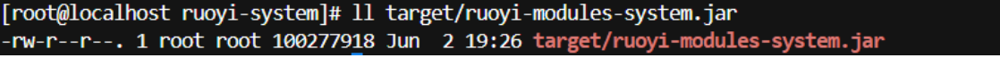
如果使⽤ mvn clean install 后端打包不成功报错 就进⼊到这个⽬录下执⾏这条命令 cd ../⼀直退到

这个⽬录下 执⾏打包命令 mvn clean install -DskipTests 执⾏成功后 进⼊到 cd ruoyi
modules/ruoyi-system/
ll target/ruoyi-modules-system.jar 成功在执⾏以下的步骤
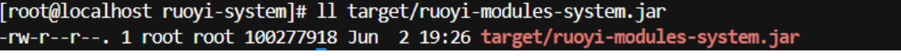
2.6 ⽣成MD5⽤于⼀会验证
md5sum target/ruoyi-modules-system.jar

⼗ . 前后端部署

1.进⼊docker执⾏copy.sh
cd ../../docker/
sh copy.sh

2 . 验证jar包MD5是否⼀致
md5sum ruoyi/modules/system/jar/ruoyi-modules-system.jar

3 . 重启ruoyi-system服务
#1.杀掉
ps -ef|grep ruoyi- |grep -v grep | awk '{print $2}' | xargs kill -9
#2. 启动
cat copy.sh
nohup java -jar ./ruoyi/modules/system/jar/ruoyi-modules-system.jar > ruoyi-modules-system.log &
或者直接执⾏ sh run.sh

3 . 查看进程
ps -ef|grep ruoyi- |grep -v grep

4 . 查看⽇志
tail -fn 100 ruoyi-modules-system.log (这个⽤来检查⽇志是否正确)

⼗⼀ . 执⾏SQL语句

1 . 打开navicat，选择ry-cloud库，查询 创建查询
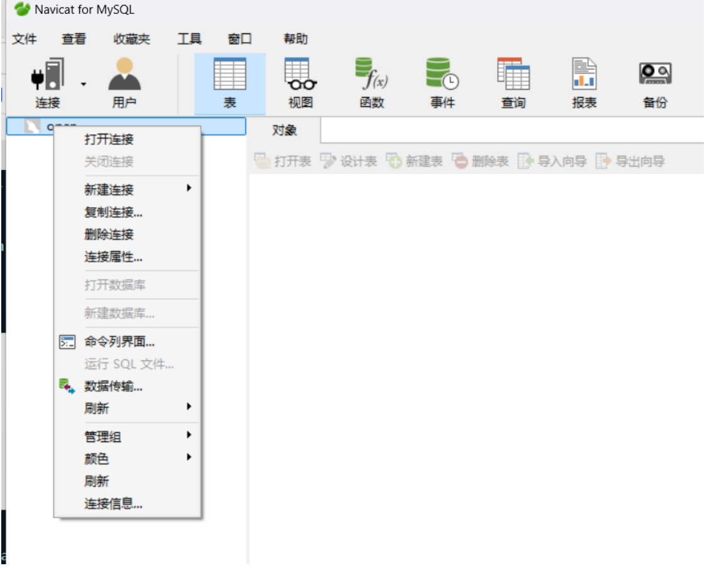
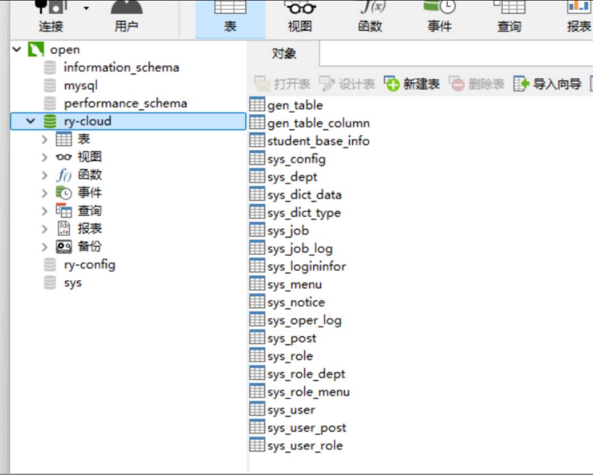
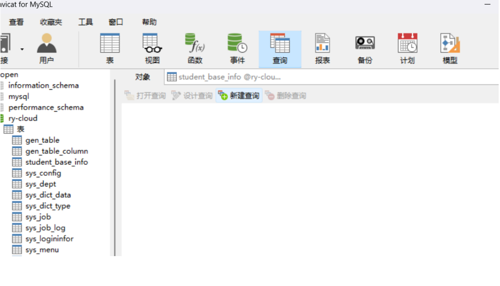
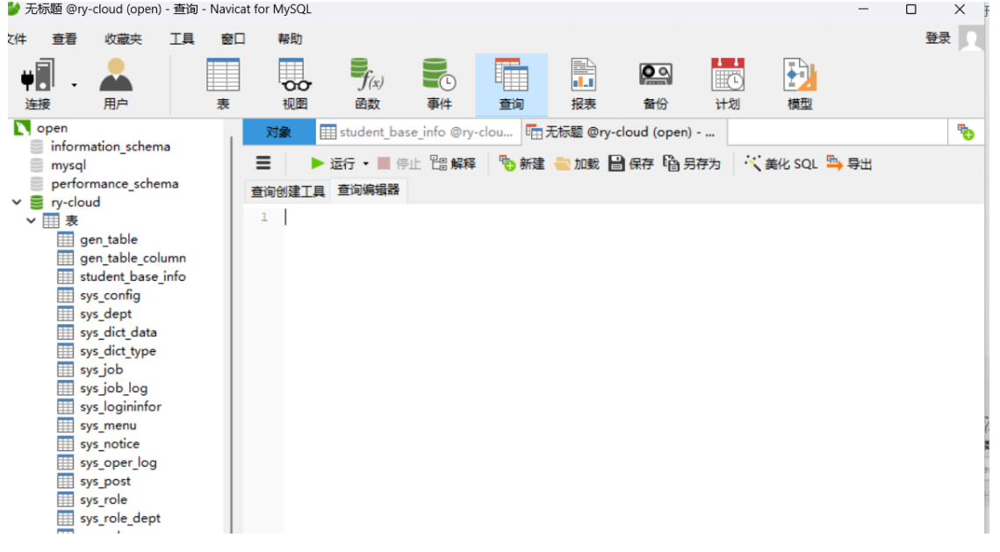

-- 菜单 SQL

insert into sys_menu (menu_name, parent_id, order_num, path, component, is_frame,
is_cache, menu_type, visible, status, perms, icon, create_by, create_time,update_by, update_time, remark)

values(``'学生基础信息'``, '3'``, '1'``, 'info'``, 'system/info/index'``, 1,0, 'C'``, '0'``, '0'``, 'system:info:list'``, '#'``, 'admin'``,sysdate(), ''``, null, '学生基础信息菜单'``);

-- 按钮父菜单ID

SELECT @parentId := LAST_INSERT_ID();

-- 按钮 SQL

insert into sys_menu (menu_name, parent_id, order_num, path, component, is_frame,is_cache, menu_type, visible, status, perms, icon, create_by, create_time,
update_by, update_time, remark)

values(``'学生基础信息查询'``, @parentId, '1'``, '#'``, ''``, 1,0, 'F'``, '0'``, '0'``, 'system:info:query'``, '#'``, 'admin'``,sysdate(), ''``, null, ''``);

insert into sys_menu (menu_name, parent_id, order_num, path, component, is_frame,
is_cache, menu_type, visible, status, perms, icon, create_by, create_time,update_by, update_time, remark)

values(``'学生基础信息新增'``, @parentId, '2'``, '#'``, ''``, 1,0, 'F'``, '0'``, '0'``, 'system:info:add'``, '#'``, 'admin'``,sysdate(), ''``, null, ''``);

insert into sys_menu (menu_name, parent_id, order_num, path, component, is_frame,
is_cache, menu_type, visible, status, perms, icon, create_by, create_time,update_by, update_time, remark)

values(``'学生基础信息修改'``, @parentId, '3'``, '#'``, ''``, 1,0, 'F'``, '0'``, '0'``, 'system:info:edit'``, '#'``, 'admin'``,sysdate(), ''``, null, ''``);

insert into sys_menu (menu_name, parent_id, order_num, path, component, is_frame,
is_cache, menu_type, visible, status, perms, icon, create_by, create_time,update_by, update_time, remark)

values(``'学生基础信息删除'``, @parentId, '4'``, '#'``, ''``, 1,0, 'F'``, '0'``, '0'``, 'system:info:remove'``, '#'``, 'admin'``,sysdate(), ''``, null, ''``);

insert into sys_menu (menu_name, parent_id, order_num, path, component, is_frame,
is_cache, menu_type, visible, status, perms, icon, create_by, create_time,update_by, update_time, remark)

values(``'学生基础信息导出'``, @parentId, '5'``, '#'``, ''``, 1,0, 'F'``, '0'``, '0'``, 'system:info:export'``, '#'``, 'admin'``,sysdate(), ''``, null, ''``);

将以上的数据复制进去

2 . 刷新ruoyi平台⻚⾯，验证
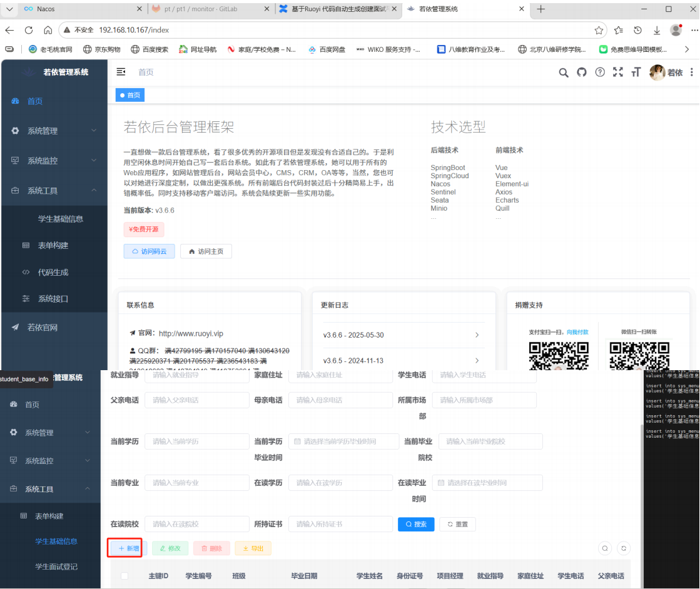