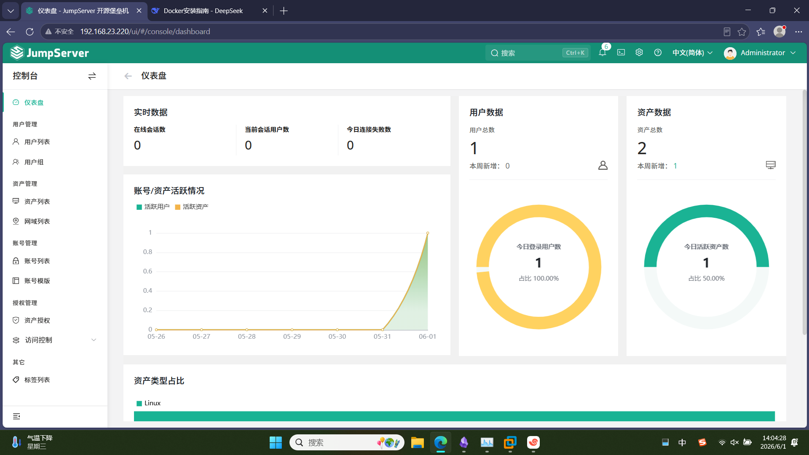
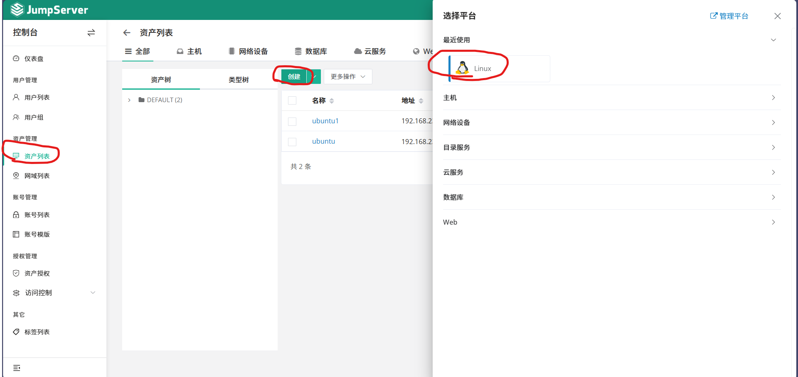
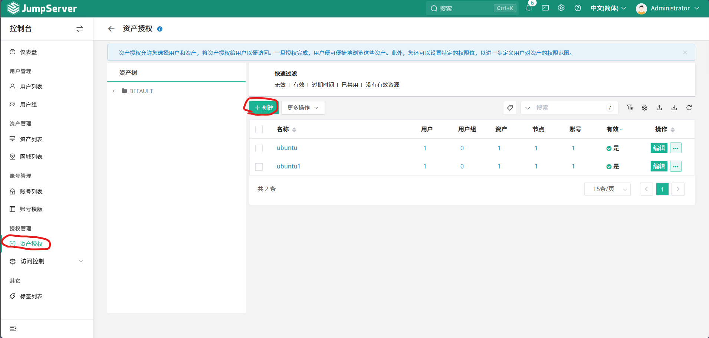
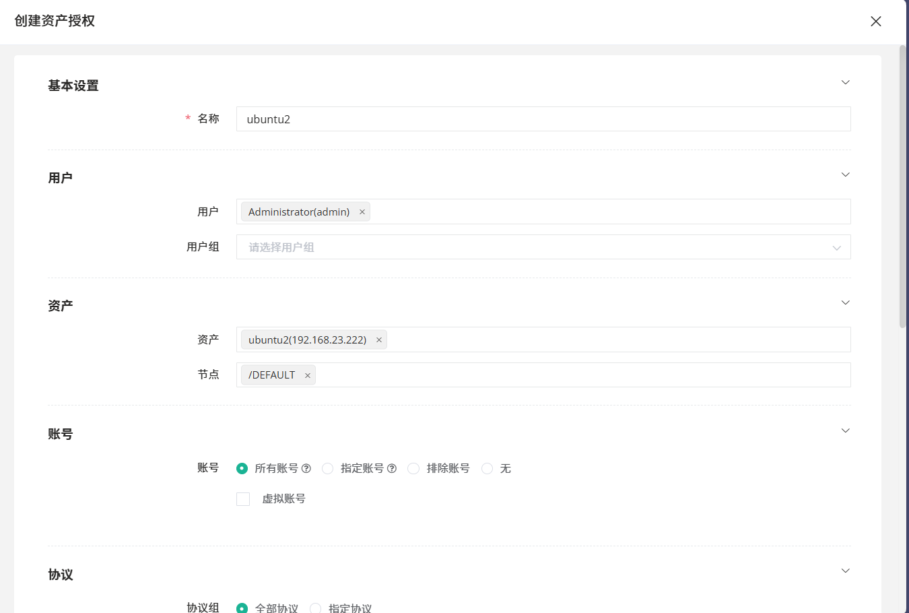
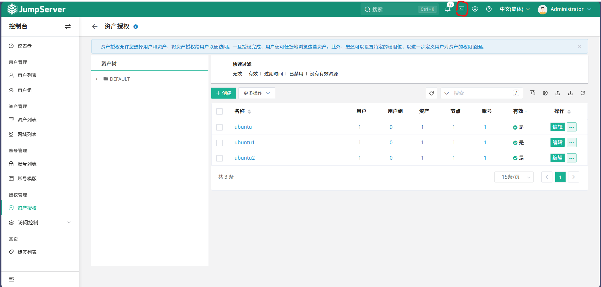
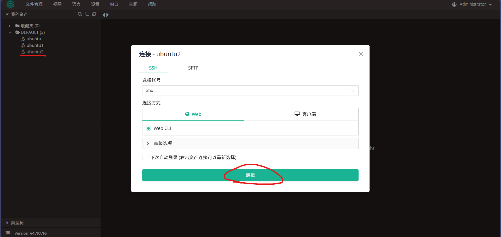

# 实验报告/技术文档：部署jumpserver

## 一、实验概述与目的

JumpServer 的核心价值在于**为企业的IT基础设施提供了一个集中的、安全的、可审计的访问入口**。它把零散的资产和分散的运维操作统一管控起来，在提升运维效率的同时，极大地增强了系统的安全性。
## 二、环境准备

虚拟机有docker环境（没有，安装docker）
**CentOS7：**
```
yum -y install docker-ce

systemctl start docker

systemctl enable docker
```
**Ubuntu:**
```
apt update

apt install -y docker-ce docker-ce-cli containerd.io docker-buildx-plugin docker-compose-plugin

systemctl start docker
```
## 三、安装与部署

### 1、配置docker镜像加速文件
```
#编写加速文件
vim /etc/docker/daemon.json

{
  "log-driver": "json-file",
  "log-opts": {
    "max-size": "5m",
    "max-file": "3"
  },
  "exec-opts": ["native.cgroupdriver=systemd"],
  "registry-mirrors": [
    "https://docker.mirrors.ustc.edu.cn",
    "https://hub-mirror.c.163.com",
    "https://docker.m.daocloud.io",
    "https://dockerproxy.com",
    "https://docker.nju.edu.cn",
    "https://hammal.staronearth.win/",
    "http://hub.staronearth.win/"
  ],
  "insecure-registries": [
    "10.203.41.23",
    "http://10.203.41.20:8088",
    "harbor.baway.work"
  ]
}

#配置完后重启应用

systemctl daemon-reload
systemctl reload docker

```
### 2、下载安装脚本

```
cd /opt/

curl -sSL https://resource.fit2cloud.com/jumpserver/jumpserver/releases/latest/download/quick_start.sh | bash

```
### 3、访问测试

#### 1）访问

点开浏览器，输入本机ip

![](Pasted_image_20260622105809.png）

初始化登录：
用户：admin
密码：ChangeMe

修改密码，登录成功后，会提示修改密码，按照提示修改即可，修改完成后，会重新登陆



#### 2）测试

a、点击左边项目栏里的资产列表，再点击创建，选中Linux平台



b、输入目标主机ip，节点默认，然后点击新增账号，使用密码认证（用户必须是虚拟机里面存在的），新增完后保存退出


c、点击左边项目栏的资产授权，点击创建



d、用户选择默认，资产选择刚刚创建的，节点默认，保存退出



e、打开终端测试效果（点击红圈）






### 4、常见问题

端口冲突：jumpserver的端口与nginx的端口发生冲突，导致jumpserver部署失败，或是页面访问不是jumpserver的页面，而是nginx的页面

解决方法：

```
ss -ntlp | grep 8080  #查看端口是否被占用
```
若被占用，找到它并删除，使端口空余出来